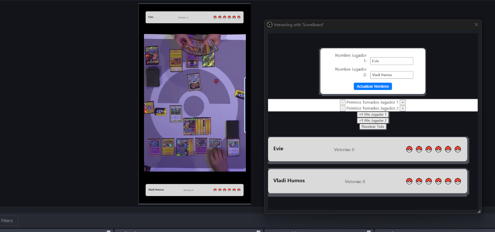

# 🎮 Pokémon TCG Scoreboard

> 🎥 Scoreboard visual para **Pokémon Trading Card Game** diseñado para usarse en **transmisiones en vivo o directos**.


Este es un proyecto ligero y fácil de integrar para mostrar el puntaje actualizado en tiempo real durante un duelo de Pokémon TCG. Puede usarse como overlay en OBS, Streamlabs u otras plataformas de streaming.

---

## 📷 Ejemplo del scoreboard utilizado en OBS



---

## 📋 Índice

1. [Características](#características)
2. [Requisitos](#requisitos)
3. [Instalación](#instalación)
4. [Uso](#uso)
5. [Personalización](#personalización)
6. [Contribuciones](#contribuciones)
7. [Licencia](#licencia)

---

## 🌟 Características

- Muestra el puntaje actual de ambos jugadores.
- Fácil de usar y rápido de actualizar.
- Interfaz limpia y minimalista para streaming.
- Compatible con OBS, Streamlabs, XSplit, etc.
- Puede personalizarse fácilmente el estilo CSS.

---

## 🛠 Requisitos

- Un software de streaming como OBS Studio o Streamlabs.

---

## 📦 Instalación

1. Clona o descarga el repositorio:

```bash
git clone https://github.com/eviecamila/ptcg-duel-scoreboard.git
cd ptcg-scoreboard
```

2. Abre el archivo `index.html` en tu navegador o como fuente de navegador en tu software de streaming.

---

## 🕹 Uso

1. Abre `index.html` en tu navegador.
3. Ajusta el tamaño de la ventana para que se vea bien como overlay.
4. Añade la URL local (o el archivo HTML) como "Fuente de navegador" en OBS/Streamlabs.

---

## 🎨 Personalización

Puedes personalizar el estilo del scoreboard editando el archivo `style.css`:

- Cambiar colores
- Ajustar fuentes
- Modificar tamaños
- Cambiar el número máximo de puntos

También puedes cambiar el diseño general editando `index.html`.

---

## 🤝 Contribuciones

¡Las contribuciones son bienvenidas! Si quieres mejorar el diseño, añadir funcionalidades o corregir errores, no dudes en hacer un **Pull Request**.

---

## 📄 Licencia

Este proyecto está bajo la licencia **MIT**. Puedes usarlo, modificarlo y distribuirlo libremente.

¡Claro! Si estás buscando una forma profesional y amigable de **pedir créditos por haber creado la idea** en un proyecto o repositorio, aquí tienes un ejemplo que puedes usar directamente en tu `README.md` o en cualquier otro documento oficial del proyecto:

---

## 🏆 Créditos

La idea original y el concepto de este proyecto fueron creados por **@eviecamla**.  
Aunque el desarrollo o implementación técnica puede haber sido colaborativo o realizado por otras personas, la iniciativa, diseño y visión principal nacieron gracias a su creatividad y esfuerzo.

Si usas esta idea o base para otro proyecto, ¡por favor reconoce los créditos! 🙌

---

> 💡 **Tip para streaming**: Si usas OBS, puedes usar esta herramienta como "Fuente de navegador" y actualizarla en tiempo real sin reiniciar la transmisión.